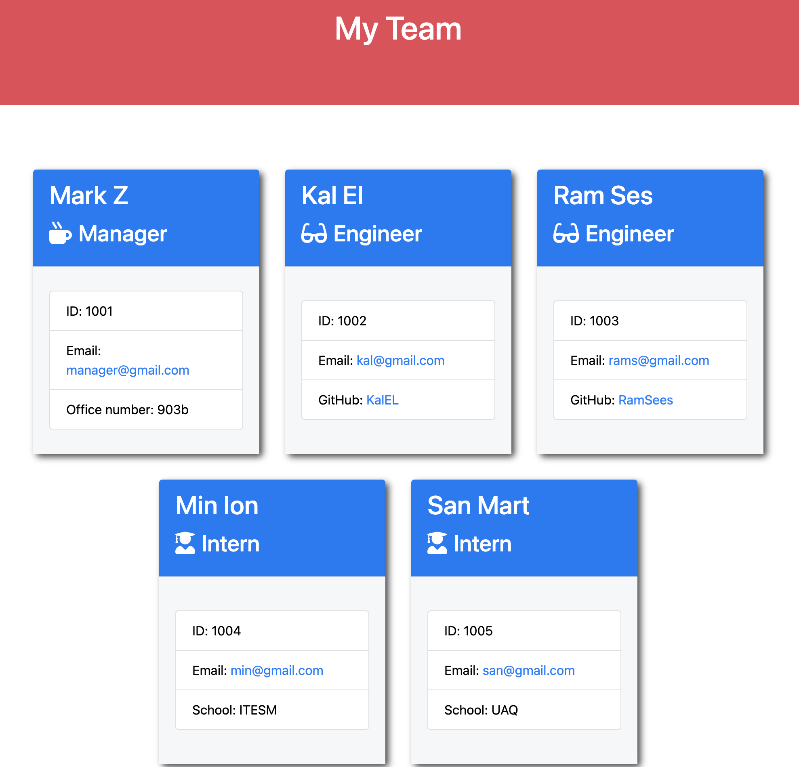

# OOP: Team Profile Generator    

  ## Table of contents
  1. [Description](#description)
  2. [Installation](#installation)
  3. [Usage](#usage)
  4. [Contributing](#contributing)
  5. [Tests](#tests)
  6. [Questions](#questions)

  ## Description 

  Built a Node.js command-line application that takes in information about employees on a software engineering team, then generates an HTML webpage that displays summaries for each person.

  ## Installation 

  Download repo folder, navigate in terminal to the project folder and install dependencies with npm i, then run tests with 'npm run test' and finally 'node index.js' in order to create your own teams. Visualize your teams in the team.html at the output subfolder.

  ## Usage 

  Anyone can use this to have a better order with their coworkers information.

  ## Contributing 

  Anyone can contribute.

  ## Tests 

  'npm run test'

  ## License

  This project works under a license of type . For more information regarding the license, follow the link 

  ## Questions 

  For additional information or any questions regarding the project, please feel free to contact me via GitHub or email.
  GitHub: MarcoTorr
  Email: marco.torres@aiesec.net

  ## Preview and walkthrough
  <a href="https://watch.screencastify.com/v/MtbKuc4PVto8zChMMEZn" target="_blank">W A L K T R O U G H | VIDEO</a>
    
  